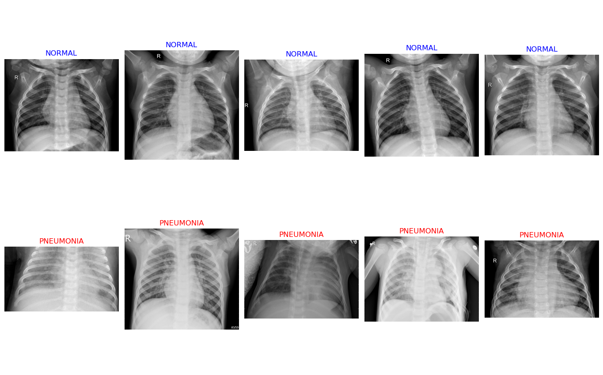
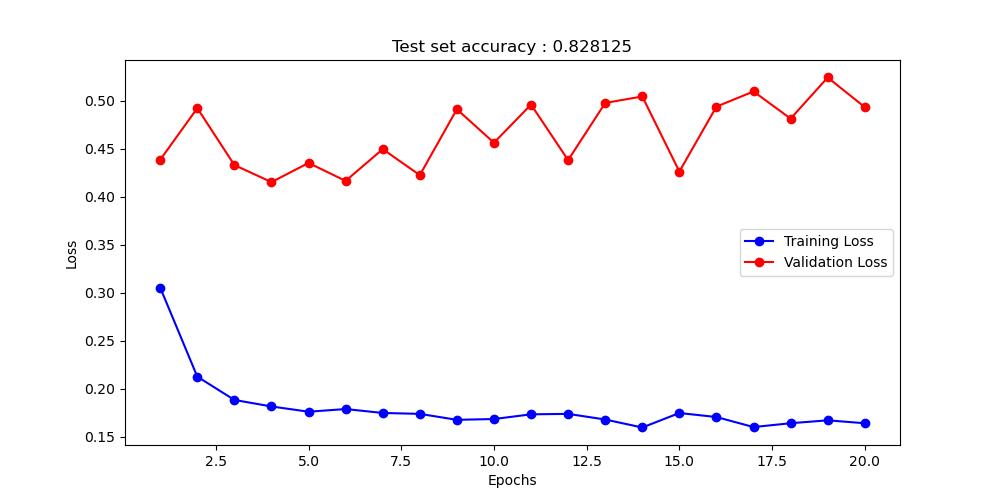

# Chest X-ray classification

## Data
The data contains chest X-ray images of healthy lungs and lungs with pneumonia. X-rays pass thorugh healthy lungs and thus the lungs appear black in x-rays.
However, with pneumonia, the lungs become more opaque and they start appearing white in the x-rays.
Some sample images are 

The objective is to develop a classifier that classifies these images as healthy / pneumonia.

## Process
Being an image classification problem, we use CNNs. Currently, there are three models, a pre-trained RESNET18 model and another model based on RESNET18,
where an additional convolution layer is added. For this extended model, a batch normalization and dropout layers are added to reduce overfitting.
There's also a custom CNN model that is built from scratch.

## Running the code
```cmd
python classifier.py --help
usage: classifier.py [-h] [--numepochs NUMEPOCHS] [--modeltype {pretrained_resnet18,modified_resnet18,custom_cnn}]

Classifies chest X-ray images as healthy or having pneumonia

options:
  -h, --help            show this help message and exit
  --numepochs NUMEPOCHS
                        Number of epochs to train the model for
  --modeltype {pretrained_resnet18,modified_resnet18,custom_cnn}
                        Choose either pretrained Resnet18, pre-trained Resnet18 with additional convolution layers, or custom cnn
```

## Experimenting with other CNN models
It is easy to add other CNN models for running more experiments. Create a new model class similar to .
Call that new class in .

## Results

Given the three models namely, the pretrained resnet18, modified resnet 18 and custom CNN, the modified resnet 18 model has the best performance on the test dataset.

|Model|Test Set Accuracy|
|-----|-----------------|
|Scratch-build CNN (Custom CNN)|75%|
|Pre-trained Resnet18|81%|
|Modified Resnet18 (with additional layers)|82%|

The plot below  shows the model performance of training and validation losses with the best model having accuracy of 82% on the test set.
